# VitePress 文檔站設置指南

> **專案**：HedgeDoc 測試文檔站  
> **建立日期**：2025-11-06  
> **VitePress 版本**：1.6.4

---

## 📋 目錄

1. [快速開始](#快速開始)
2. [關鍵配置說明](#關鍵配置說明)
3. [重要教訓與注意事項](#重要教訓與注意事項)
4. [常見問題與解決方案](#常見問題與解決方案)
5. [目錄結構](#目錄結構)
6. [部署指南](#部署指南)

---

## 🚀 快速開始

### 安裝與啟動

```bash
# 安裝依賴
npm install

# 開發模式（自動偵測可用端口）
npm run docs:dev

# 建置生產版本
npm run docs:build

# 預覽生產版本
npm run docs:preview
```

### 訪問文檔站

開發伺服器會自動尋找可用端口（通常是 5173、5174 等），在終端中會顯示實際的 URL。

---

## ⚙️ 關鍵配置說明

### 核心配置檔案

**位置**：`docs/.vitepress/config.ts`

### 最重要的配置：`markdown.html: false`

```typescript
export default defineConfig({
  markdown: {
    html: false,  // ⚠️ 關鍵配置！
    lineNumbers: true,
    theme: {
      light: 'github-light',
      dark: 'github-dark'
    }
  }
})
```

#### 為什麼必須設置 `html: false`？

**問題背景**：
- VitePress 預設會將 Markdown 文件編譯為 Vue 組件
- 文件中的 HTML 標籤（包括 `<NOTE>`, `<ALIAS>`, `<TAG>` 等）會被 Vue 誤認為組件
- 即使在 code block 中，某些情況下也會被錯誤解析
- 導致編譯錯誤：`Element is missing end tag`

**解決方案**：
- 設置 `html: false` 禁用 Markdown 中的 HTML 解析
- 這樣所有 `<...>` 格式的內容都會被視為純文字
- **不會影響**：code block 語法高亮、VitePress 功能組件、導航、搜索等

**影響範圍**：
- ✅ 保留：Markdown 語法、code block、Vue 組件（通過正常方式引入）
- ❌ 禁用：在 Markdown 中直接寫 HTML 標籤（如 `<div>`, `<span>` 等）

---

## 🎯 重要教訓與注意事項

### 1. 端口管理

**❌ 錯誤做法**：
```json
{
  "scripts": {
    "docs:dev": "vitepress dev docs --port 5173"  // 不要固定端口！
  }
}
```

**✅ 正確做法**：
```json
{
  "scripts": {
    "docs:dev": "vitepress dev docs"  // 讓系統自動分配端口
  }
}
```

**原因**：
- 端口可能被其他應用佔用
- VitePress 會自動尋找可用端口（5173 → 5174 → 5175...）
- 固定端口會導致衝突和啟動失敗

**記憶規則**：
- 🚫 **絕對禁止**使用 `kill`、`lsof`、`pkill` 清理端口
- 🚫 **絕對禁止**在配置中寫死端口號
- ✅ 讓開發伺服器自動處理端口分配

### 2. 模塊系統配置

**必須在 `package.json` 中添加**：
```json
{
  "type": "module"
}
```

**原因**：
- VitePress 1.6.4+ 是 ESM-only 模塊
- 沒有這個配置會導致啟動錯誤
- 配置文件需要使用 ESM 語法（`import.meta.url` 而非 `__dirname`）

### 3. Config 文件中的 `__dirname` 處理

**在 ESM 模式下需要手動定義**：
```typescript
import { fileURLToPath } from 'url'
import { dirname } from 'path'

const __filename = fileURLToPath(import.meta.url)
const __dirname = dirname(__filename)
```

### 4. Markdown 文件注意事項

**可能導致編譯錯誤的內容**：
- `<NOTE>`、`<ALIAS>`、`<ID>` 等尖括號包裹的佔位符
- URL 中的下底線（如 `43hzF0Y6R4u7VmcLrtn_5Q`）在某些情況下
- 未配對的 `<` 或 `>` 符號

**解決方案**：
1. **全局方案**：在配置中設置 `markdown.html: false`（推薦）
2. **局部方案**：使用 inline code 包裹（如 `` `<NOTE>` ``）
3. **特定區塊**：使用 v-pre 容器（不推薦，太麻煩）

### 5. PlantUML 警告處理

**問題**：
```
The language 'plantuml' is not loaded, falling back to 'txt' for syntax highlighting.
```

**解決方案**：
```markdown
# 原本（會有警告）

```plantuml
@startuml
...
@enduml
```


# 修改為（無警告）
```text
@startuml
...
@enduml
```
```

### 6. 文件名和資料夾名命名規則（極度重要！）

**問題**：
- 文件名包含空格（如 `1.1 標準操作指南.md`）
- 資料夾名包含空格和中文（如 `1. 使用指南/`）
- 導致 VitePress 的相對連結 `./` 語法**完全失效**
- 連結被渲染成純文字，無法點擊

**症狀**：
```markdown
<!-- 這樣的連結會變成純文字！ -->
[1.1 標準操作指南](./1.1 標準操作指南)
```

**根本原因**：
- VitePress 在處理連結時無法正確解析包含空格和特殊字符的路徑
- URL 編碼問題導致路由匹配失敗
- 相對路徑解析器遇到空格就失效

**✅ 正確的命名規則**：

1. **使用 kebab-case**（全小寫，用連字號）：
   ```
   ✅ quick-start.md
   ✅ 1.1-standard-operation-guide.md
   ❌ Quick Start.md
   ❌ 1.1 標準操作指南.md
   ```

2. **資料夾命名**：
   ```
   ✅ 01-guide/
   ✅ 02-api-reference/
   ❌ 1. 使用指南/
   ❌ 2. API 參考/
   ```

3. **編號格式**：
   - 資料夾：`01-`, `02-`, `03-` （兩位數）
   - 文件：`1.0-`, `1.1-`, `2.1-` （層級編號）

**✅ 正確的連結語法**：
```markdown
<!-- 同目錄內使用相對路徑 -->
[Overview](./1.0-overview)

<!-- 跨目錄使用絕對路徑 -->
[Guide](/01-guide/1.1-standard-operation-guide)

<!-- 不要加 .md 副檔名！ -->
```

**⚠️ 絕對禁止**：
- ❌ 文件名或資料夾名包含空格
- ❌ 文件名或資料夾名包含中文字符
- ❌ 連結中包含 `.md` 副檔名
- ❌ 使用絕對 URL（除非是外部連結）

**教訓**：
這個問題浪費了大量時間，因為：
1. VitePress 不會顯示任何錯誤訊息
2. 連結會被渲染成純文字，看起來像是 markdown 沒解析
3. 問題很難察覺，因為 build 仍然成功

**最佳實踐**：
- 從一開始就使用英文和連字號命名
- 定期測試所有連結是否可點擊
- 不要依賴自動掃描時的顯示名稱，側邊欄會自動格式化

---

## 🔧 常見問題與解決方案

### Q1: 頁面顯示空白或錯誤

**症狀**：瀏覽器顯示錯誤頁面，終端顯示 `Element is missing end tag`

**診斷步驟**：
1. 檢查終端錯誤訊息，找出問題文件和行號
2. 查看該行是否有 `<...>` 格式的內容
3. 確認 `config.ts` 中是否設置了 `markdown.html: false`

**解決方案**：
```typescript
// docs/.vitepress/config.ts
export default defineConfig({
  markdown: {
    html: false  // 添加這一行
  }
})
```

### Q2: 修改配置後沒有生效

**解決步驟**：
1. 清理緩存：
   ```bash
   rm -rf docs/.vitepress/cache docs/.vitepress/dist node_modules/.vite
   ```
2. 重啟開發伺服器（配置文件修改需要重啟）
3. 強制刷新瀏覽器（Cmd/Ctrl + Shift + R）

### Q3: 側邊欄沒有顯示新文件

**原因**：側邊欄配置使用了 `generateSidebar()` 函數，在啟動時執行

**解決方案**：
- 重啟開發伺服器（配置文件會重新執行）
- 或者改用動態生成側邊欄的方式

### Q4: 首頁樣式異常

**檢查項目**：
1. `docs/index.md` 的 frontmatter 是否正確
2. `layout: home` 是否設置
3. hero 和 features 配置是否完整

---

## 📁 目錄結構

```
test-hedgedoc/
├── docs/                          # 文檔根目錄
│   ├── .vitepress/               # VitePress 配置目錄
│   │   ├── config.ts            # 主配置文件 ⚠️ 重要
│   │   ├── cache/               # 快取（自動生成，需 gitignore）
│   │   └── dist/                # 建置輸出（自動生成，需 gitignore）
│   ├── index.md                 # 首頁
│   ├── archive/                 # 歸檔文件目錄
│   │   ├── README.md
│   │   └── ...
│   ├── VERIFICATION-REPORT.md   # 各種文檔
│   ├── STANDARD-OPERATION-GUIDE.md
│   └── ...
├── package.json                 # 必須包含 "type": "module"
├── .gitignore                   # 需要忽略 cache、dist 等
└── docs-README.md              # 使用說明
```

### 自動掃描機制

**功能**：`generateSidebar()` 函數會自動掃描 `docs/` 目錄

**規則**：
- 根目錄的 `.md` 文件（除了 `index.md`）→ 「文檔」分類
- 子目錄的 `.md` 文件 → 以目錄名為分類
- 自動生成導航結構

**添加新文件**：
1. 在 `docs/` 目錄下創建 `.md` 文件
2. 重啟開發伺服器
3. 新文件會自動出現在側邊欄

---

## 🚀 部署指南

### 準備工作

```bash
# 建置生產版本
npm run docs:build

# 輸出位置：docs/.vitepress/dist
```

### 部署到 Vercel

1. 推送到 GitHub
2. 在 Vercel 匯入專案
3. 設置：
   - **Build Command**: `npm run docs:build`
   - **Output Directory**: `docs/.vitepress/dist`
   - **Install Command**: `npm install`

### 部署到 Netlify

1. 推送到 GitHub
2. 在 Netlify 匯入專案
3. 設置：
   - **Build command**: `npm run docs:build`
   - **Publish directory**: `docs/.vitepress/dist`

### 部署到 GitHub Pages

```bash
# 建置
npm run docs:build

# 部署
cd docs/.vitepress/dist
git init
git add -A
git commit -m 'deploy'
git push -f git@github.com:username/repo.git main:gh-pages
```

---

## 📝 維護檢查清單

### 定期檢查

- [ ] VitePress 版本是否有更新
- [ ] Node.js 版本是否符合要求
- [ ] 依賴套件是否有安全更新

### 添加新文件時

- [ ] 確認文件名不包含特殊字符
- [ ] 檢查是否有未閉合的標籤
- [ ] 使用 inline code 包裹特殊符號
- [ ] 測試在瀏覽器中是否正常顯示

### 修改配置後

- [ ] 清理緩存
- [ ] 重啟開發伺服器
- [ ] 測試所有主要頁面
- [ ] 檢查終端是否有錯誤

---

## 🔍 除錯技巧

### 1. 檢查終端輸出

開發伺服器的終端會顯示：
- 編譯錯誤的文件名和行號
- 警告訊息
- 實際運行的端口號

### 2. 使用瀏覽器開發者工具

- Console：查看 JavaScript 錯誤
- Network：檢查資源載入狀況
- Elements：檢查實際渲染的 HTML

### 3. 測試命令

```bash
# 檢查頁面是否正常
curl -s http://localhost:5174/VERIFICATION-REPORT | head -20

# 查看終端錯誤
# 直接觀察開發伺服器的輸出

# 清理並重建
rm -rf docs/.vitepress/cache docs/.vitepress/dist node_modules/.vite
npm run docs:dev
```

---

## 📚 參考資源

- [VitePress 官方文檔](https://vitepress.dev/)
- [VitePress GitHub](https://github.com/vuejs/vitepress)
- [Markdown-it 文檔](https://markdown-it.github.io/)
- [Vue 3 文檔](https://vuejs.org/)

---

## 🎓 核心教訓總結

1. **文件名絕對不能包含空格或中文** ⚠️ **最重要的教訓！**
   - 使用 kebab-case：`1.1-standard-operation-guide.md`
   - 不要用：`1.1 標準操作指南.md`
   - 會導致所有相對連結失效，變成純文字

2. **永遠不要固定端口** - 讓系統自動分配

3. **永遠不要清理其他應用的端口** - 可能影響到其他服務

4. **使用 `markdown.html: false`** - 避免 Vue 誤判 markdown 內容

5. **使用 ESM 模式** - 在 package.json 中設置 `"type": "module"`

6. **配置修改需要重啟** - VitePress 不會自動重載配置文件

7. **測試才是真理** - 修改後必須實際訪問驗證，不能假設成功

---

**最後更新**：2025-11-06  
**維護者**：AI Assistant

