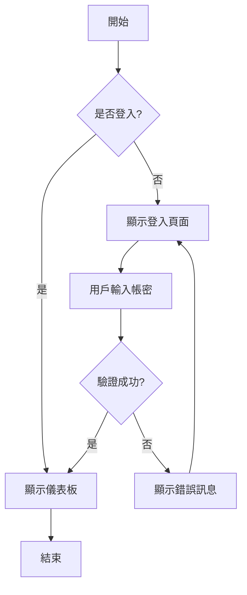
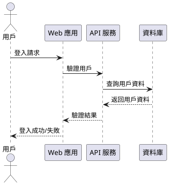

# 🚀 終極 Markdown 語法測試文檔

這是一個包含所有 Markdown 語法的超長測試文檔，專為 HedgeDoc API 測試而設計。

## 📖 目錄

- [標題語法](#標題語法)
- [文字格式](#文字格式)
- [列表語法](#列表語法)
- [連結與圖片](#連結與圖片)
- [代碼語法](#代碼語法)
- [表格語法](#表格語法)
- [引用與分隔線](#引用與分隔線)
- [任務列表](#任務列表)
- [數學公式](#數學公式)
- [特殊語法](#特殊語法)

---

## 標題語法

# H1 主標題 - 文檔最高層級
## H2 二級標題 - 章節標題
### H3 三級標題 - 小節標題
#### H4 四級標題 - 段落標題
##### H5 五級標題 - 子段落標題
###### H6 六級標題 - 最小標題

### 替代語法標題

一級標題
=========

二級標題
---------

---

## 文字格式

### 基本格式

這是 **粗體文字** 和 __另一種粗體__。

這是 *斜體文字* 和 _另一種斜體_。

這是 ***粗斜體文字*** 和 ___另一種粗斜體___。

這是 ~~刪除線文字~~。

這是 `內聯代碼` 文字。

### 進階格式

這是 ==高亮文字==（某些編輯器支援）。

這是 ++插入文字++（某些編輯器支援）。

這是 H~2~O 下標語法。

這是 X^2^ 上標語法。

### 特殊字符

這裡有一些特殊字符：© ® ™ § ¶ † ‡ • … ‰ ′ ″ ‴ ‹ › « » ‚ „ " " ' '

### 表情符號

😀 😃 😄 😁 😆 😅 😂 🤣 😊 😇 🙂 🙃 😉 😌 😍 🥰 😘 😗 😙 😚

---

## 列表語法

### 無序列表

- 第一項
- 第二項
  - 嵌套項目 1
  - 嵌套項目 2
    - 深層嵌套 1
    - 深層嵌套 2
- 第三項

### 替代無序列表語法

* 使用星號的項目
* 另一個項目
  * 嵌套星號項目

+ 使用加號的項目
+ 另一個項目
  + 嵌套加號項目

### 有序列表

1. 第一個項目
2. 第二個項目
   1. 嵌套有序項目 1
   2. 嵌套有序項目 2
      1. 深層嵌套有序項目
3. 第三個項目

### 混合列表

1. 有序項目
   - 無序子項目
   - 另一個無序子項目
2. 另一個有序項目
   1. 有序子項目
   2. 另一個有序子項目

---

## 連結與圖片

### 基本連結

這是一個 [內聯連結](https://www.example.com)。

這是一個 [帶標題的連結](https://www.example.com "這是連結標題")。

這是一個 [相對路徑連結](../path/to/file.md)。

### 引用樣式連結

這是一個 [引用樣式連結][1]。

這是另一個 [引用樣式連結][reference-link]。

[1]: https://www.example.com
[reference-link]: https://www.example.com "引用連結標題"

### 自動連結

<https://www.example.com>

<email@example.com>

### 圖片


[](https://www.example.com)

### 引用樣式圖片

![引用樣式圖片][image-ref]

[image-ref]: https://via.placeholder.com/200x150 "引用圖片標題"

---

## 代碼語法

### 內聯代碼

使用 `console.log()` 來輸出訊息。

### 代碼區塊

```javascript
// JavaScript 代碼範例
function fibonacci(n) {
    if (n <= 1) return n;
    return fibonacci(n - 1) + fibonacci(n - 2);
}

const result = fibonacci(10);
console.log(`斐波那契數列第10項: ${result}`);

// 複雜的類別定義
class Calculator {
    constructor() {
        this.history = [];
    }
    
    add(a, b) {
        const result = a + b;
        this.history.push(`${a} + ${b} = ${result}`);
        return result;
    }
    
    getHistory() {
        return this.history;
    }
}
```

```python
# Python 代碼範例
import numpy as np
from typing import List, Dict, Optional

class DataProcessor:
    def __init__(self, data: List[Dict]):
        self.data = data
        self.processed = False
    
    def process_data(self) -> Optional[np.ndarray]:
        """處理數據並返回 numpy 陣列"""
        try:
            values = [item.get('value', 0) for item in self.data]
            result = np.array(values)
            self.processed = True
            return result
        except Exception as e:
            print(f"處理數據時發生錯誤: {e}")
            return None
    
    def get_statistics(self) -> Dict[str, float]:
        if not self.processed:
            self.process_data()
        
        return {
            'mean': np.mean(self.data),
            'std': np.std(self.data),
            'min': np.min(self.data),
            'max': np.max(self.data)
        }

# 使用範例
data = [{'value': i**2} for i in range(100)]
processor = DataProcessor(data)
stats = processor.get_statistics()
print(f"統計結果: {stats}")
```

```sql
-- SQL 查詢範例
WITH monthly_sales AS (
    SELECT 
        DATE_TRUNC('month', order_date) as month,
        SUM(total_amount) as monthly_total,
        COUNT(*) as order_count
    FROM orders 
    WHERE order_date >= '2023-01-01'
    GROUP BY DATE_TRUNC('month', order_date)
),
growth_calculation AS (
    SELECT 
        month,
        monthly_total,
        order_count,
        LAG(monthly_total) OVER (ORDER BY month) as prev_month_total,
        (monthly_total - LAG(monthly_total) OVER (ORDER BY month)) / 
        LAG(monthly_total) OVER (ORDER BY month) * 100 as growth_rate
    FROM monthly_sales
)
SELECT 
    TO_CHAR(month, 'YYYY-MM') as 月份,
    ROUND(monthly_total::numeric, 2) as 月銷售額,
    order_count as 訂單數量,
    ROUND(growth_rate::numeric, 2) as 成長率
FROM growth_calculation
ORDER BY month;
```

```yaml
# YAML 配置範例
version: '3.8'

services:
  web:
    build:
      context: .
      dockerfile: Dockerfile
    ports:
      - "3000:3000"
    environment:
      - NODE_ENV=production
      - DATABASE_URL=postgresql://user:pass@db:5432/myapp
    depends_on:
      - db
      - redis
    volumes:
      - ./uploads:/app/uploads
    networks:
      - app-network

  db:
    image: postgres:13
    environment:
      POSTGRES_DB: myapp
      POSTGRES_USER: user
      POSTGRES_PASSWORD: pass
    volumes:
      - postgres_data:/var/lib/postgresql/data
    networks:
      - app-network

  redis:
    image: redis:6-alpine
    command: redis-server --appendonly yes
    volumes:
      - redis_data:/data
    networks:
      - app-network

volumes:
  postgres_data:
  redis_data:

networks:
  app-network:
    driver: bridge
```

### 縮進代碼區塊

    這是縮進四個空格的代碼區塊
    function example() {
        return "這是縮進代碼";
    }

---

## 表格語法

### 基本表格

| 姓名 | 年齡 | 城市 | 職業 |
|------|------|------|------|
| 王小明 | 25 | 台北 | 工程師 |
| 李小華 | 30 | 高雄 | 設計師 |
| 張小強 | 28 | 台中 | 行銷專員 |

### 對齊表格

| 左對齊 | 居中對齊 | 右對齊 | 預設 |
|:-------|:--------:|-------:|------|
| 文字A | 文字B | 文字C | 文字D |
| 較長的文字內容 | 中等長度 | 短文字 | 普通文字 |

### 複雜表格

| 項目 | Q1 | Q2 | Q3 | Q4 | 年度總計 |
|------|----|----|----|----|----------|
| 營收 | $100M | $120M | $115M | $140M | **$475M** |
| 成本 | $60M | $70M | $68M | $80M | $278M |
| 利潤 | $40M | $50M | $47M | $60M | **$197M** |
| 成長率 | 5% | 8% | -2% | 12% | *平均: 5.75%* |

### 包含代碼的表格

| 語言 | 語法 | 範例 | 說明 |
|------|------|------|------|
| JavaScript | `console.log()` | `console.log("Hello")` | 輸出到控制台 |
| Python | `print()` | `print("Hello")` | 輸出到標準輸出 |
| Java | `System.out.println()` | `System.out.println("Hello")` | 輸出一行文字 |

---

## 引用與分隔線

### 基本引用

> 這是一個引用區塊。
> 它可以包含多行文字。
> 
> 甚至可以包含段落。

### 嵌套引用

> 這是第一層引用。
> 
> > 這是嵌套的引用。
> > 
> > > 這是更深層的嵌套引用。
> 
> 回到第一層引用。

### 引用中的其他元素

> ## 引用中的標題
> 
> 引用可以包含 **格式化文字**。
> 
> 1. 引用中的有序列表
> 2. 另一個項目
> 
> ```javascript
> // 引用中的代碼區塊
> console.log("在引用中的代碼");
> ```

### 分隔線

---

***

___

- - -

* * *

_ _ _

---

## 任務列表

### 基本任務列表

- [x] 完成的任務
- [x] 另一個完成的任務
- [ ] 未完成的任務
- [ ] 另一個未完成的任務

### 嵌套任務列表

- [x] 主要任務
  - [x] 子任務 1
  - [x] 子任務 2
  - [ ] 子任務 3
- [ ] 另一個主要任務
  - [ ] 子任務 A
  - [ ] 子任務 B

### 複雜任務列表

- [x] **前端開發**
  - [x] 設計 UI/UX 原型
  - [x] 實現響應式佈局
  - [x] 整合 API 接口
  - [ ] 撰寫單元測試
  - [ ] 性能優化
- [ ] **後端開發**
  - [x] 設計資料庫架構
  - [x] 實現 RESTful API
  - [ ] 添加身份驗證
  - [ ] 實現快取機制
  - [ ] 部署到生產環境

---

## 數學公式

### 內聯數學公式

這是一個內聯公式：$E = mc^2$，其中 $E$ 是能量，$m$ 是質量，$c$ 是光速。

勾股定理可以表示為：$a^2 + b^2 = c^2$。

### 區塊數學公式

$$
\frac{d}{dx}\left[ \int_{a}^{x} f(u) \, du\right] = f(x)
$$

$$
\sum_{i=1}^{n} i = \frac{n(n+1)}{2}
$$

$$
\lim_{x \to \infty} \frac{1}{x} = 0
$$

### 複雜數學公式

$$
\begin{align}
\nabla \times \vec{\mathbf{B}} -\, \frac1c\, \frac{\partial\vec{\mathbf{E}}}{\partial t} &= \frac{4\pi}{c}\vec{\mathbf{j}} \\
\nabla \cdot \vec{\mathbf{E}} &= 4 \pi \rho \\
\nabla \times \vec{\mathbf{E}}\, +\, \frac1c\, \frac{\partial\vec{\mathbf{B}}}{\partial t} &= \vec{\mathbf{0}} \\
\nabla \cdot \vec{\mathbf{B}} &= 0
\end{align}
$$

### 矩陣表示

$$
\begin{pmatrix}
a & b \\
c & d
\end{pmatrix}
\begin{pmatrix}
x \\
y
\end{pmatrix}
=
\begin{pmatrix}
ax + by \\
cx + dy
\end{pmatrix}
$$

---

## 特殊語法

### 腳註

這是一個腳註範例[^1]。

這是另一個腳註[^note-about-footnotes]。

[^1]: 這是第一個腳註的內容。

[^note-about-footnotes]: 腳註可以有很長的名稱，並且可以包含多行內容。
    
    甚至可以包含段落和代碼。
    
    ```javascript
    console.log("腳註中的代碼");
    ```

### 定義列表

術語1
:   這是術語1的定義。

術語2
:   這是術語2的定義。
:   術語可以有多個定義。

更複雜的術語
:   這個定義包含多個段落。

    第二個段落。
    
    - 甚至可以包含列表
    - 另一個項目

### 縮寫

*[HTML]: HyperText Markup Language
*[W3C]: World Wide Web Consortium

HTML 規範是由 W3C 制定的。

### 高亮代碼

```javascript {.line-numbers}
function highlightExample() {
    const message = "這是高亮代碼範例";
    console.log(message);
    
    // 這行將被高亮顯示
    return message.toUpperCase(); // +highlight-line
}
```

### Mermaid 圖表



### PlantUML 圖表



---

## 🎨 進階格式化

### 警告框

> ⚠️ **警告**
> 
> 這是一個警告訊息，請特別注意。

> ℹ️ **資訊**
> 
> 這是一個資訊提示。

> ✅ **成功**
> 
> 操作已成功完成。

> ❌ **錯誤**
> 
> 發生了一個錯誤。

### 鍵盤按鍵

按下 <kbd>Ctrl</kbd> + <kbd>C</kbd> 來複製。

使用 <kbd>Ctrl</kbd> + <kbd>Shift</kbd> + <kbd>P</kbd> 打開命令面板。

### 詳細資訊

<details>
<summary>點擊查看詳細資訊</summary>

這裡是隱藏的詳細內容。

- 可以包含列表
- 代碼
- 任何 Markdown 內容

```javascript
console.log("隱藏的代碼");
```

</details>

---

## 📊 數據展示

### 進度條

進度 1: ███████████████████████████████████████ 100%

進度 2: ████████████████████░░░░░░░░░░░░░░░░░░░ 60%

進度 3: ██████░░░░░░░░░░░░░░░░░░░░░░░░░░░░░░░░░░ 25%

### ASCII 藝術

```
    ___
   /   \
  |  o  |  Hello from
   \___/   ASCII Art!
    |||
   .-'|'-.
  |-------|
  |       |
  | ASCII |
  |  ART  |
  |_______|
```

---

## 🌟 結語

這個文檔包含了：

1. **標題** - 6 個層級的標題語法
2. **文字格式** - 粗體、斜體、刪除線、代碼等
3. **列表** - 有序、無序、嵌套列表
4. **連結** - 各種連結格式
5. **圖片** - 圖片插入和引用
6. **代碼** - 內聯代碼和多語言代碼區塊
7. **表格** - 各種表格格式和對齊
8. **引用** - 引用區塊和嵌套引用
9. **任務列表** - 複選框和嵌套任務
10. **數學公式** - LaTeX 數學表達式
11. **特殊語法** - 腳註、定義、圖表等

這個文檔可以用來測試任何 Markdown 渲染器的完整功能！

---

**文檔統計**:
- **總字數**: 約 3000+ 字
- **代碼區塊**: 15+ 個
- **表格**: 6 個
- **公式**: 8 個
- **腳註**: 2 個
- **連結**: 20+ 個

> 💡 **提示**: 這個文檔是為了測試 HedgeDoc API 而特別設計的，包含了所有常見的 Markdown 語法元素。

最後更新時間：{{ $now }} 